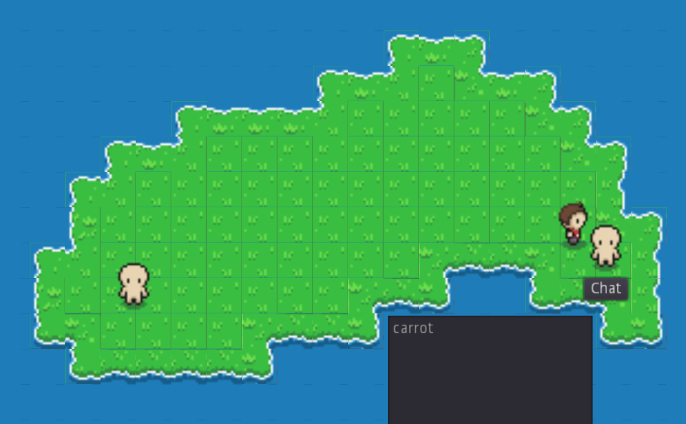

A simple demo for using ChatGPT in a Godot game.

Move with the arrow keys or WASD. When you are close to an NPC,
a "Chat" button will appear.

### NOTE
 
You need an API key for this to work.

Open GPTClient.gd and update the API_KEY constant.

### Screenshot

